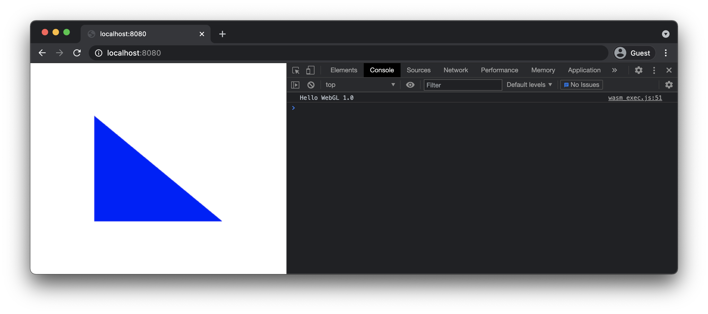
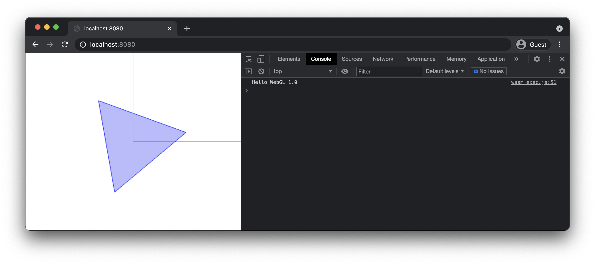
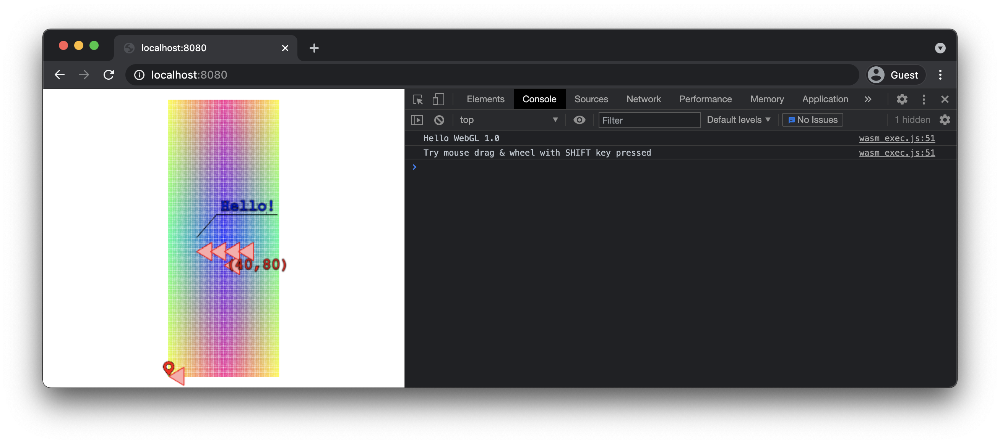
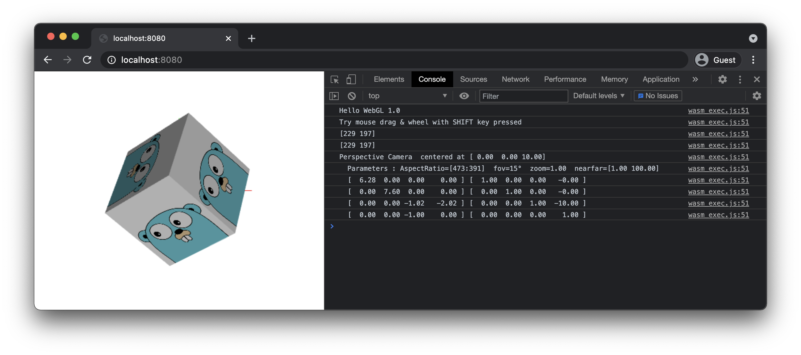
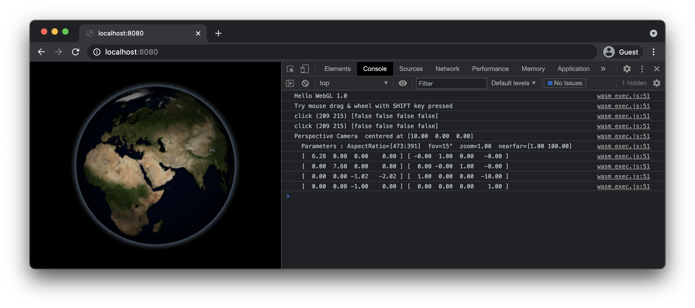

# GIGL : Interactive 2D & 3D Graphics Library in Go

GIGL implements full set of high-level constructs of interactive 2D & 3D graphics 
(such as Camera, Scene, Geometry, Material, Overlay, etc.) entirely in Go, 
so that they can be easily used in any OpenGL/WebGL environments on native applications or webapps in a browser.

*This project is under development, and backward-incompatible changes will be made.*

## How to Build & Run 

Simplest example: &emsp; _(for explaining how WebGL/OpenGL works)_
```bash
$ make                  # source : 'examples/webgl_1st/main.go'
or
$ make opengl_1st       # source : 'examples/opengl_1st/main.go'
```


2D example: &emsp; _(for basic 2D usage with Geometry)_
```bash
$ make webgl_2d         # source : 'examples/webgl_2d/main.go'
or
$ make opengl_2d        # source : 'examples/opengl_2d/main.go'
```


2Di example: &emsp; _(with Geometry Instaces, Labels & Markers)_
```bash
$ make webgl_2di        # source : 'examples/webgl_2di/main.go'
```


3D example: &emsp; _(basic 3D usage with Geometry, Texture and Camera)_
```bash
$ make webgl_3d        # source : 'examples/webgl_3d/main.go'
or
$ make opengl_3d       # source : 'examples/opengl_3d/main.go'
```


Globe example: &emsp; _(with a specialized sphere and glow effect for the Globe)_
```bash
$ make webgl_globe    # source : 'examples/webgl_globe/main.go'
```


## ToDo List

- examples for other OpenGL environment on native applications
- overlay (marker/label) layers for Globe
- user selection using collision detection with a ray from camera
- graticules on the globe
- coast lines and country border lines on the world map
- support for world map projections (Mercator, Stereographic, etc)

## Notes on OpenGL Environments

Supporting different OpenGL environments is not a trivial task, and it always has been a headache for a starter. 
We really want to make it as easy as possible.
For a webapp in a browser, we use the experimental Go support (syscall/js) for [WebAssembly](https://github.com/golang/go/wiki/WebAssembly).
For a native app, we use [go-gl](https://github.com/go-gl)'s modules such as [gl](https://github.com/go-gl/gl) & [glfw](https://github.com/go-gl/glfl).
In order to deal with different versions of GLSL (OpenGL Shading Language), we have written all the shader codes in *WebGL 1.0* (`#version 100 es`) as the default GLSL version, and convert shader codes automatically into *OpenGL 4.1* (`#version 410`) for OpenGL environments. Note that *OpenGL 4.1* and *OpenGL ES 2.0* and *WebGL 1.0* are mostly compatible with each other.

## Thanks

I hope this project can help many people to learn 2D & 3D graphics and to build awesome applications in Go.  
Special thanks to [go-gl](https://github.com/go-gl) group and [Richard Musiol](https://github.com/neelance), for their visions and so many contributions.  
If you hava a feedback or suggestion, contact [go4orward](https://github.com/go4orward).

Resources taken from:
- [Go Gopher images](https://golang.org/doc/gopher/) : originally created by Renee French
- [VisibleEarth by NASA](https://visibleearth.nasa.gov/collection/1484/blue-marble) : world satellite images
- [NaturalEarth](https://www.naturalearthdata.com/) : public domain map dataset
