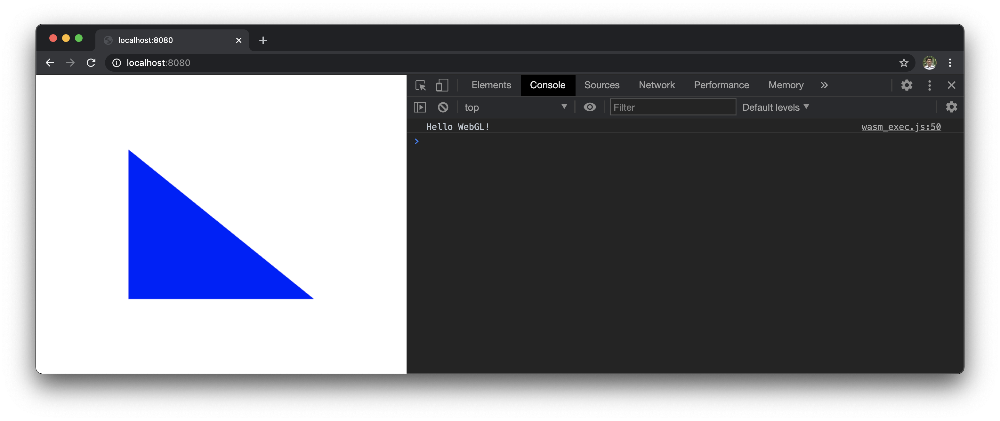
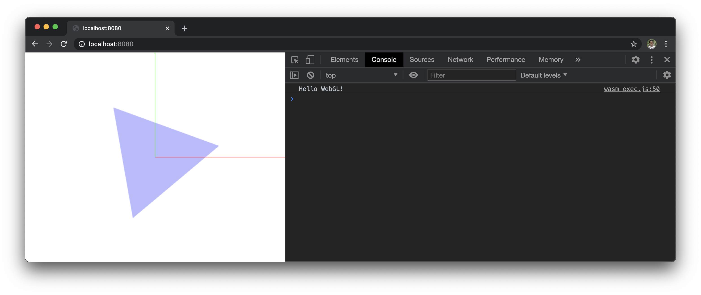
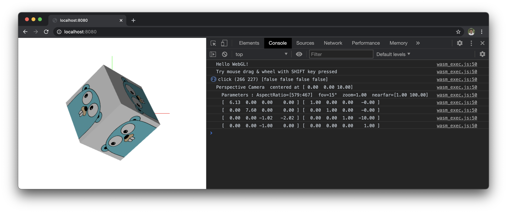
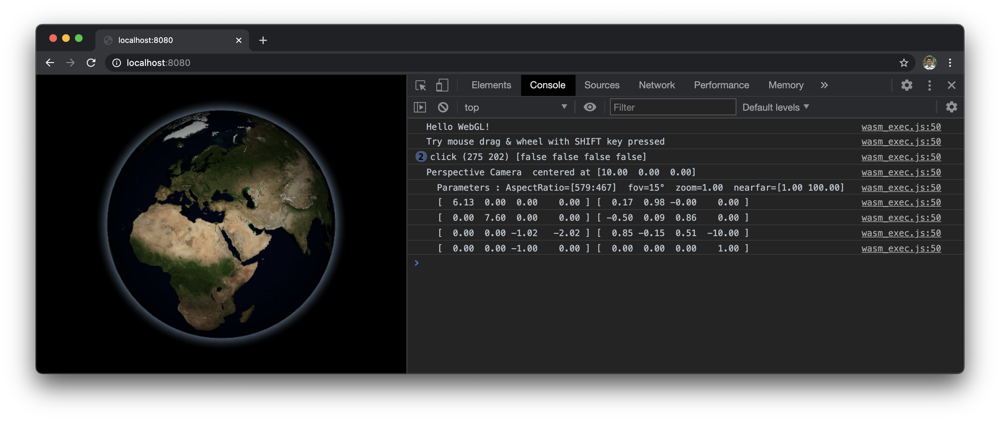

# GIGL : Interactive 2D & 3D Graphics Library in Go

GIGL implements full set of high-level constructs of interactive 2D & 3D graphics 
(such as Camera, Scene, Geometry, Material, Overlay, etc.) entirely in Go, 
so that they can be easily used in any OpenGL/WebGL environments on native applications or webapps in a browser.

*At the moment, all the examples are running in WebGL/WASM environment on a browser, 
but I plan to experiment with other OpenGL environments on native applications in near future.*

## How to Build & Run (WebGL/WASM example)

Simplest example: &emsp; _(for explaining how WebGL works)_
```bash
$ make                  # source : 'examples/webgl1st_example.go'
```


2D example: &emsp; _(with animation & user interactions)_
```bash
$ make 2d               # source : 'examples/webgl2d_example.go'
or
$ make 2dui             # source : 'examples/webgl2dui_example.go'
```


3D example: &emsp; _(with perspective & orthographic camera)_
```bash
$ make 3d               # source : 'examples/webgl3d_example.go'
```


Globe example: &emsp; _(with perspective & orthographic camera)_
```bash
$ make globe            # source : 'examples/webglglobe_example.go'
```


## ToDo List

- examples for other OpenGL environment on native applications
- overlay (marker/label) layers for Globe
- user selection using collision detection with a ray from camera
- graticules on the globe
- coast lines and country border lines on the world map
- support for world map projections (Mercator, Stereographic, etc)
- 'webglgalaxy' maybe? :)

## Thanks

I hope this project can help many people to learn 2D & 3D graphics and to build awesome applications in Go.  
Many thanks to [Richard Musiol](https://github.com/neelance), for his vision and contributions for GopherJS and WebAssembly for Go. If you hava a feedback or suggestion, contact [go4orward](https://github.com/go4orward).

Resources taken from:
- [Go Gopher images](https://golang.org/doc/gopher/) : originally created by Renee French
- [VisibleEarth by NASA](https://visibleearth.nasa.gov/collection/1484/blue-marble) : world satellite images
- [NaturalEarth](https://www.naturalearthdata.com/) : public domain map dataset
